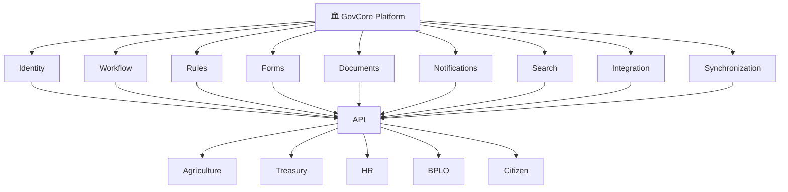
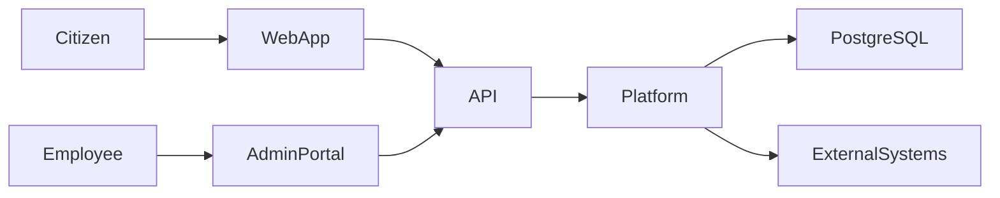
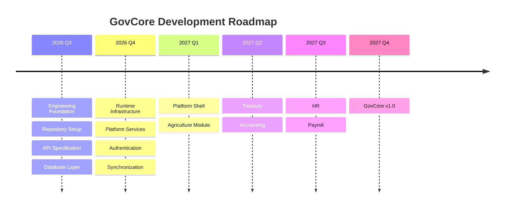
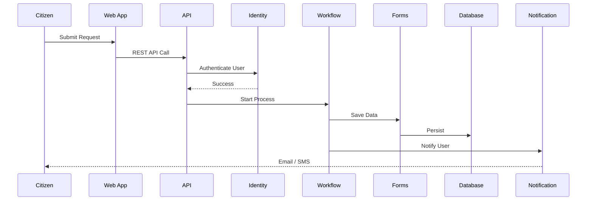

<div align="center">

# 🏛 GovCore

### The Digital Operating System for Philippine Local Governments

*A modular, enterprise-grade GovTech platform for building secure, scalable, and configurable digital government services.*


---

**GovCore aims to become a unified digital platform that enables Philippine Local Government Units (LGUs) to modernize public service delivery through reusable platform services and modular government applications.**

</div>

---

# 📖 Overview

Many government systems are developed independently, resulting in duplicated infrastructure, inconsistent user experiences, and difficult maintenance.

**GovCore** addresses this by providing a shared digital platform where multiple government services can run on a common foundation.

Instead of building separate applications for every office, GovCore provides reusable platform capabilities that future modules can share, helping reduce duplication and improve consistency.

---

# 🎯 Vision

To build a modern, secure, configurable, and scalable digital operating system for Philippine Local Government Units.

---

# ✨ Goals

- Reduce duplicated software development across LGUs
- Standardize common government platform services
- Encourage modular application development
- Improve interoperability through API-first architecture
- Support cloud and future on-premise deployments
- Provide a foundation for future GovTech innovation

---

# 🏗 Platform Concept



---

# 🏛 High-Level Architecture



---

# ⚙ Core Design Principles

- One Platform
- One Codebase
- One Login
- Modular Architecture
- Multi-Tenant Ready
- API-First
- Secure by Design
- Configurable over Custom Development
- Reusable Platform Services
- Enterprise Development Practices

---

# 📦 Planned Government Modules

| Module | Status |
|---------|--------|
| Agriculture | 🚧 Planned |
| Treasury | ⏳ Planned |
| Accounting | ⏳ Planned |
| Budget | ⏳ Planned |
| Human Resources | ⏳ Planned |
| Payroll | ⏳ Planned |
| BPLO | ⏳ Planned |
| Citizen Portal | ⏳ Planned |
| Engineering | ⏳ Planned |
| Disaster Risk Reduction | ⏳ Planned |
| Social Welfare | ⏳ Planned |
| Health | ⏳ Planned |

---

# 🛠 Technology Stack

## Frontend

- React
- TypeScript
- Vite

## Backend

- Node.js
- Express
- TypeScript

## Database

- PostgreSQL
- Drizzle ORM

## API

- OpenAPI
- Zod
- Orval

## Tooling

- PNPM Workspace
- GitHub Actions
- ESLint
- Prettier
- Vitest

---

# 📂 Repository Structure

```text
govcore/

├── artifacts/
│
├── lib/
│   ├── api-client-react/
│   ├── api-spec/
│   ├── api-zod/
│   ├── db/
│   ├── integration-engine/
│   └── search/
│
├── scripts/
├── tests/
├── .github/
├── package.json
└── pnpm-workspace.yaml
```

---

# 🚀 Development Roadmap



---

# 🔄 Example Request Flow



---

# 📈 Current Development Status

| Sprint | Status |
|---------|--------|
| Engineering Foundation | ✅ Completed |
| Search Engine | ✅ Implemented |
| Integration Engine | ✅ Implemented |
| Runtime Infrastructure | 🚧 In Progress |
| Platform Shell | ⏳ Planned |
| Agriculture Module | ⏳ Planned |

---

# 🚀 Getting Started

## Clone

```bash
git clone https://github.com/PrinceVigoli/govcore.git
```

## Install

```bash
pnpm install
```

## Run Development Server

```bash
pnpm dev
```

## Run Tests

```bash
pnpm test
```

## Build

```bash
pnpm build
```

---

# 🤝 Contributing

Contributions, feature suggestions, bug reports, and discussions are welcome.

Please review the project's contribution guidelines before opening pull requests.

---

# 📜 License

This project is licensed under the MIT License.

---

# 👨‍💻 Author

**Cornelio G. Lantes Jr.**

Bachelor of Science in Information Technology

Philippines

---

<div align="center">

### Building modern digital solutions for Philippine Local Governments.

⭐ If you find this project interesting, consider giving it a star.

</div>
